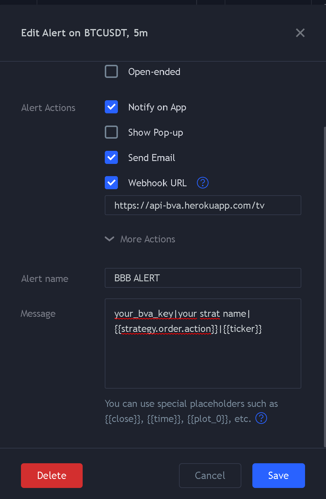

<h1 align="center">tradingview alert binance trader</h1>

To connect your Trading View alerts to BVA, simply add the web hook: https://api-bva.herokuapp.com/tv

The format of the Trading View alert text should be:

```your_bva_key|your strategy name|{{strategy.order.action}}|{{ticker}}```

**your_bva_key** is your BVA key you can find after signing up at https://bitcoinvsaltcoins.com

**your strategy name** is the name of your strategy name, changing it will track a new strategy.

[](https://bitcoinvsaltcoins.com)


<a href="https://bitcoinvsalts.com" target="_new">Crypto Trading Strategy Marketplace</a>